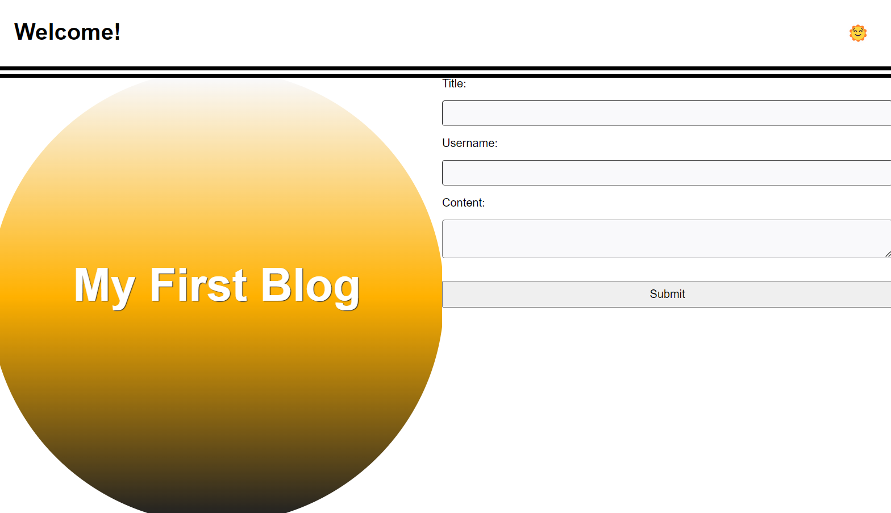
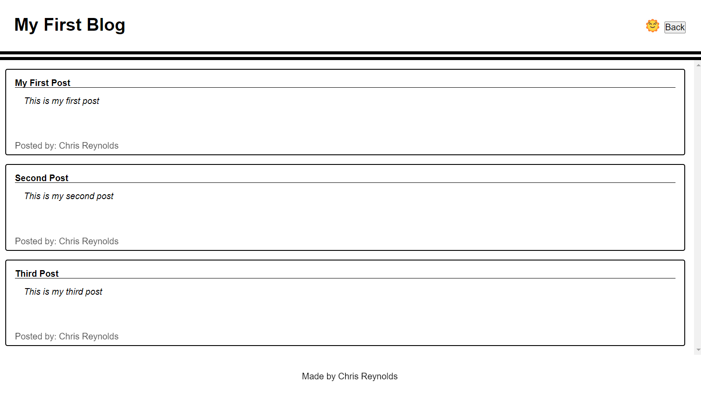

# Blog-website

## Description
This webpage is a personal blog. The user is asked to enter the title of their blog post, their username, and the content of their post.   

## Installing
N/a

## Usage
Open the webpage and fill out the required form.  If you miss filling in one or all of the items in the form you will be met with an alert asking you to complete all required fields.  There is a light and dark mode toggle button the the top right of the webpage which will switch the styling of the blog website to light or dark mode upon clicking the emoji.  

Once all required fields are filled out and submitted, you will be redirected to the blog post page.  This will display all current and previous content on the screen.  There is a back button in the top right of the screen that will redirect you back to the landing page if needed.  

If you click the portfolio link in the bottom left of the blog post webpage, you will be redirected to my portfolio page in a seperate tab.

## Screenshot 

## URL
https://chrisreynolds0508.github.io/Blog-website/

## Authors
Chris Reynolds

## License
Please refer to the license in the repo.